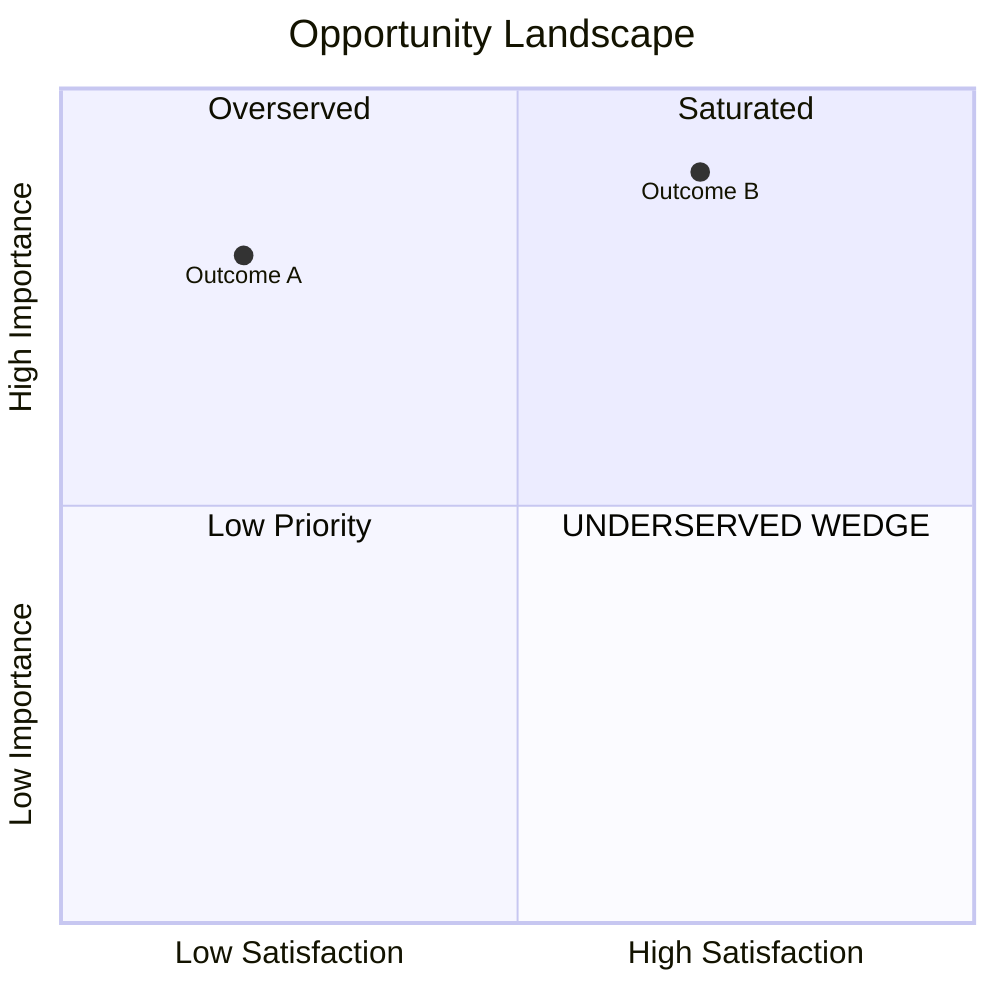

# pd-score (Phase 07)

You are running Ulwick's opportunity-scoring math. **The formula is `Importance + max(Importance - Satisfaction, 0)`.** The `max(..., 0)` floor is non-cosmetic — it's the most common technical error in ODI implementations.

Load: `references/opportunity-scoring.md` before producing output.

## The formula

```
Opportunity = Importance + max(Importance − Satisfaction, 0)
```

On 1-10 scales. When Satisfaction ≥ Importance, the gap term is zero (never negative).

### Threshold bands

| Score | Band | Meaning |
|---|---|---|
| < 10 | Overserved | Compete on cost, not features |
| 10–12 | Marginal | Adequate; modest opportunity |
| 12–15 | Underserved | Real innovation opportunity |
| > 15 | Ripe | High priority; premium pricing viable |
| > 20 | Extreme | Severe market neglect (rare) |

### Worked examples

- Importance 9, Satisfaction 2 → 9 + max(9-2, 0) = 9 + 7 = **16** → Ripe
- Importance 5, Satisfaction 8 → 5 + max(5-8, 0) = 5 + 0 = **5** → Overserved
- Importance 8, Satisfaction 5 → 8 + max(8-5, 0) = 8 + 3 = **11** → Marginal
- Importance 10, Satisfaction 1 → 10 + 9 = **19** → Ripe (almost extreme)

## What this skill produces

`.discovery/<topic>/07-scoring/OPPORTUNITY.md` with:

1. **The scoring table** — Per outcome: Importance, Satisfaction (per major competitor), max satisfaction, opportunity score, band
2. **The quadrant plot** — Importance (Y axis 1-10) × Satisfaction (X axis 1-10), each outcome a point
3. **Underserved outcomes list** — All outcomes scoring 12+, ordered by score
4. **Per-competitor satisfaction matrix** — Outcomes × competitors grid
5. **Source notes** — Where each importance and satisfaction estimate came from
6. **The CRITICAL disclaimer** — All scores are `[MODEL ESTIMATE]` until validated by real survey

## Process

### Step 1: Load OUTCOMES.md + competitor teardowns
- Importance estimates already drafted in OUTCOMES.md
- Per-competitor satisfaction estimates from `06-competitors/*.md`

### Step 2: For each outcome, populate per-competitor satisfaction

Satisfaction (1-10) per competitor per outcome. Estimate from:
- Mined reviews (Phase 02): does this competitor satisfy this outcome?
- Competitor teardown's review-coding (Phase 06)
- Feature availability + execution quality
- User churn signals

**Tag every score `[MODEL ESTIMATE — from mined evidence]`.**

### Step 3: Take max satisfaction across competitors

Per outcome: `Satisfaction = max(competitor_satisfactions)` — the best available solution for this outcome.

Rationale: an outcome is "served" if ANY competitor satisfies it; the gap is the unserved residual.

### Step 4: Apply the formula

```
Opportunity = Importance + max(Importance − max_Satisfaction, 0)
```

Compute for every outcome. Round to integer.

### Step 5: Band and rank

Sort by opportunity score descending. Apply the band labels. Underserved (12+) is the working list; Ripe (15+) is the priority list.

### Step 6: Render the quadrant

Use a markdown table with positions:

```
                            HIGH SATISFACTION
                                  |
                                  |
                  Quadrant 2      |     Quadrant 1
                (overserved)      |  (saturated luxury)
                                  |
                                  |
LOW IMPORTANCE  -----------------+------------------ HIGH IMPORTANCE
                                  |
                                  |
                  Quadrant 3      |     Quadrant 4
                (low priority)    |   (UNDERSERVED — wedge)
                                  |
                                  |
                            LOW SATISFACTION
```

Plot each outcome by its (Importance, max_Satisfaction) pair. Q4 (high I, low S) is where the wedge lives.

You can also produce a Mermaid quadrantChart block (some Claude Code renders it):


### Step 7: Per-competitor satisfaction matrix

A second table: rows = outcomes, columns = competitors, cells = satisfaction. Highlights which competitor "owns" which outcome.

### Step 8: The disclaimer

At top of OPPORTUNITY.md:

> ⚠️ **All scores are `[MODEL ESTIMATE]` derived from mined evidence.** No customer survey has been run. These scores are valid for *directional* prioritization only. Survey validation required before betting strategy on specific scores.

## Anti-patterns

| Symptom | STOP |
|---|---|
| Computed `I + (I-S)` without the max floor | Re-compute with `max(I-S, 0)` |
| Scores presented as facts not estimates | Tag every score `[MODEL ESTIMATE]` |
| Outcome scored without evidence pointer | Cite which Phase-02 quote / teardown supports the estimate |
| Demographic segmentation in scoring | Outcome importance varies by job context, not demographic |
| Single competitor's satisfaction used | Take max across competitors per outcome |
| No quadrant rendering | Include both table and visual format |

## Quick reference

| Threshold | Action |
|---|---|
| < 10 | Don't compete here on features |
| 10-12 | Consider, low priority |
| 12-15 | Real opportunity — investigate further |
| 15-20 | Ripe — strong wedge candidate |
| > 20 | Extreme — possibly a category-defining gap |

## What comes next

Phase 08 (`pd-wedge`) takes the top 3-5 underserved outcomes and writes the wedge thesis.
