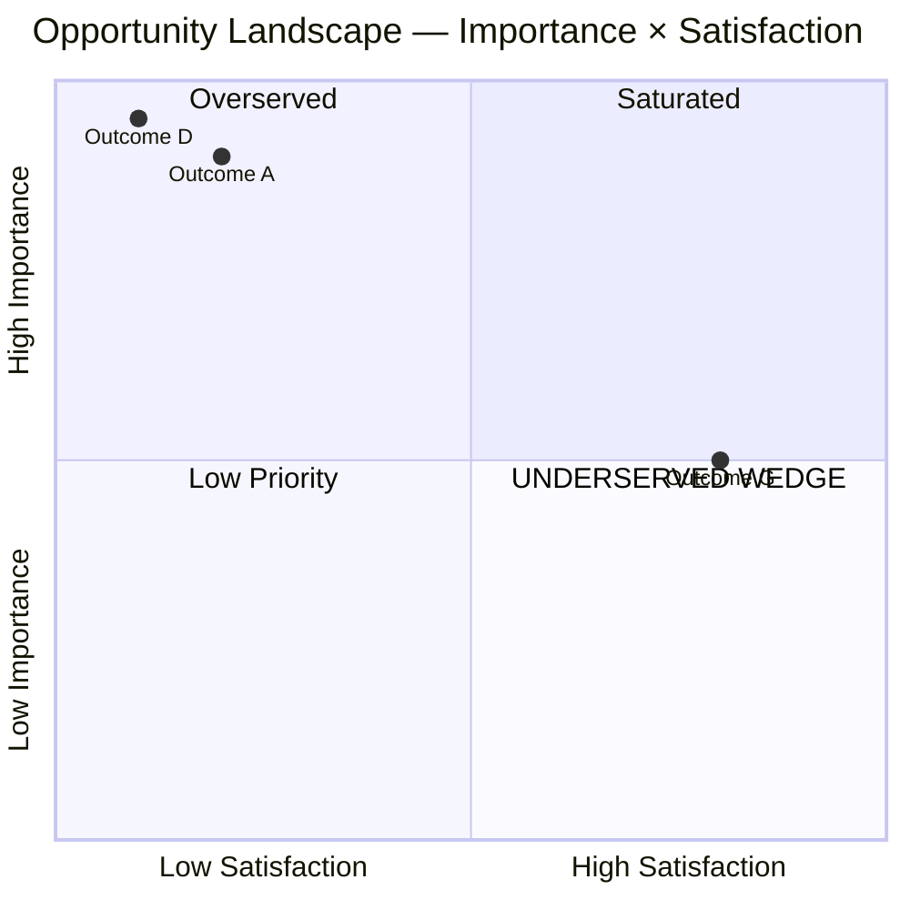

# Opportunity Scoring: <topic>

**Date:** <YYYY-MM-DD>
**Formula:** `Opportunity = Importance + max(Importance − Satisfaction, 0)` on 1-10 scales
**Threshold bands:** <10 Overserved | 10-12 Marginal | 12-15 Underserved | >15 Ripe | >20 Extreme

> ⚠️ **All scores are `[MODEL ESTIMATE]` derived from mined evidence.** No customer survey has been run. These scores are valid for *directional* prioritization only. Survey validation required before betting strategy on specific scores.

---

## Scoring table

| Outcome | Importance | Sat (max across comp) | Opportunity | Band |
|---|---|---|---|---|
| <ulwick outcome 1> | 9 | 2 | 16 | **Ripe** |
| <ulwick outcome 2> | 8 | 5 | 11 | Marginal |
| <ulwick outcome 3> | 7 | 6 | 8 | Overserved |
| <ulwick outcome 4> | 10 | 1 | 19 | **Ripe** |
| ... |

---

## Per-competitor satisfaction matrix

|  | Competitor A | Competitor B | Competitor C | Max |
|---|---|---|---|---|
| Outcome 1 | 2 | 4 | 1 | 4 |
| Outcome 2 | 7 | 5 | 8 | 8 |
| ... |

---

## Opportunity quadrant

```
                    HIGH SATISFACTION
                          |
                          |   ⚪ Outcome G (5, 8)
                          |
       OVERSERVED         |     SATURATED
       quadrant 2         |     quadrant 1
                          |
                          |
LOW IMP ──────────────────┼────────────────── HIGH IMPORTANCE
                          |
                          |   ⭐ Outcome A (16) — RIPE
       LOW PRIORITY       |   ⭐ Outcome D (19) — RIPE
       quadrant 3         |     UNDERSERVED WEDGE
                          |     quadrant 4
                          |
                    LOW SATISFACTION
```

Mermaid version (some Claude Code render):



---

## Underserved outcomes (ranked) — feed into Phase 08 Wedge

1. **<outcome>** — score 19 (Ripe) — Evidence: VOICES Theme 5, Sunsama teardown firers
2. **<outcome>** — score 16 (Ripe) — Evidence: ...
3. **<outcome>** — score 14 (Underserved) — Evidence: ...

---

## Source notes

Per outcome, the evidence informing each score:

- **Outcome 1 importance 9:** VOICES Theme 3 (5 verbatim quotes, 3 platforms)
- **Outcome 1 satisfaction (max=4):** Competitor A teardown (review coding showed only ~40% positive on this outcome)
- ...

---

## Segmentation view (if applicable)

If outcomes have different importance across sub-segments (Ulwick's killer move):

| Outcome | Segment X opportunity | Segment Y opportunity |
|---|---|---|
| ... | 16 [Ripe] | 8 [Overserved] |

Outcome-based segments often reveal hidden wedges.

---

## Next phase
→ `pd-wedge` (Phase 08) — synthesize the underserved-JTBD thesis from these scored opportunities
